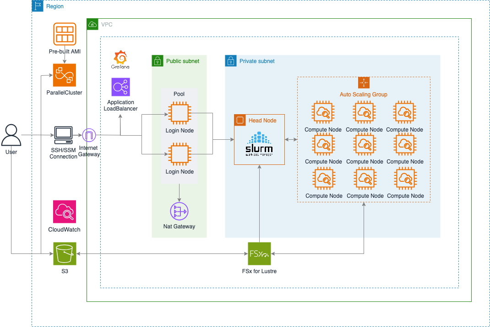

# AWS ParallelCluster for Distributed Training



AWS ParallelCluster assets for building a distributed training environment. Supports using GPU and CPU instances as compute nodes, and includes a monitoring stack and automated configuration.

## 🏗️ Architecture Overview

### Node Roles

- **LoginNode Pool (Optional)**: 
  - For user SSH access and job submission
  - Performs data preprocessing and simple tasks
  - Protects the HeadNode’s compute resources
  - Public Subnet (SSH allowed only from specific IPs)
  
- **HeadNode**: 
  - Slurm scheduler and job management
  - Functions as NFS server (shared /home)
  - Located in a Private Subnet (security)
  
- **ComputeNodes**: 
  - Dedicated for GPU workload execution
  - Located in a Private Subnet
  - Supports auto-scaling (Slurm integrated)
  - High-speed inter-node communication via EFA

### Monitoring Architecture

**AWS Managed Services (Recommended)**:
- **Amazon Managed Prometheus (AMP)**: Metric storage and query
- **Amazon Managed Grafana (AMG)**: Dashboarding and visualization
- **Advantages**: No maintenance burden, high availability, automatic scaling, AWS SSO integration

**Self-hosting (Alternative)**:
- Standalone Monitoring Instance (t3.medium)
- Operate Prometheus + Grafana manually
- HTTPS access via ALB
- Operates independently from the cluster

## 📁 Directory Structure
```bash
.
├── README.md                                    # This file
├── guide/                                       # Detailed guide documents
│   ├── AMP-AMG-SETUP.md                         # AWS Managed Prometheus + Grafana setup
│   ├── DCGM-TO-CLOUDWATCH.md                    # GPU metric monitoring
│   ├── EFA-MONITORING.md                        # EFA network monitoring
│   ├── NVLINK-MONITORING.md                     # NVLink monitoring
│   ├── PROMETHEUS-METRICS.md                    # Prometheus metric guide
│   ├── QUICKSTART-EFA-MONITORING.md             # Quick start guide
│   ├── CLUSTER-RECREATION-GUIDE.md              # Cluster re-creation guide
│   ├── TIMEOUT-CONFIGURATION.md                 # Timeout configuration guide
│   └── README.md                                # Guide index
│
├── parallelcluster-infrastructure.yaml          # CloudFormation infrastructure template
├── cluster-config.yaml.template                 # Cluster config template
├── environment-variables.sh                     # Environment variable template
├── environment-variables-bailey.sh              # Environment variable example (bailey)
│
├── config/                                      # Node setup scripts (for S3 upload)
│   ├── README.md                                # Description of config directory
│   ├── STRUCTURE-SUMMARY.md                     # Structure summary
│   ├── monitoring/                              # Monitoring instance setup
│   │   ├── README.md                            # UserData auto-install description
│   │   └── setup-monitoring-instance.sh         # Manual reinstallation (optional)
│   ├── headnode/                                # HeadNode setup
│   │   └── setup-headnode.sh                    # Prometheus + CloudWatch
│   ├── loginnode/                               # LoginNode setup
│   │   └── setup-loginnode.sh                   # Basic tools + CloudWatch
│   ├── compute/                                 # ComputeNode setup
│   │   └── setup-compute-node.sh                # GPU/CPU installation modes
│   ├── cloudwatch/                              # CloudWatch setup
│   │   ├── dcgm-to-cloudwatch.sh                # DCGM metric export
│   │   └── create-efa-dashboard.sh              # EFA dashboard creation
│   ├── nccl/                                    # NCCL installation scripts
│   └── efa/                                     # EFA driver installation
│
├── scripts/                                     # Utility scripts
│   ├── check-compute-setup.sh                   # Verify compute node setup
│   ├── monitor-compute-node-setup.sh            # Monitor installation progress
│   └── upload-monitoring-scripts.sh             # Upload scripts to S3
│
└── security-best-practices/                     # Security guidelines
    └── SECURITY.md                              # Security best practices
```

## 📦 Prerequisites

```bash
# AWS CLI v2
curl "https://awscli.amazonaws.com/awscli-exe-linux-x86_64.zip" -o "awscliv2.zip"
unzip awscliv2.zip && sudo ./aws/install

# AWS ParallelCluster CLI v3.14.0 in virtual environment
python3 -m venv pcluster-venv
source pcluster-venv/bin/activate
pip install --upgrade "aws-parallelcluster==3.14.0"

# envsubst (template variable substitution)
# MacOS
curl -L https://github.com/a8m/envsubst/releases/download/v1.2.0/envsubst-`uname -s`-`uname -m` -o envsubst
chmod +x envsubst && sudo mv envsubst /usr/local/bin

# Linux (CloudShell already includes it by default)
sudo yum install -y gettext  # Amazon Linux
# sudo apt-get install -y gettext-base  # Ubuntu

# AWS credential configuration
# Region must match the region where the cluster will be deployed, referenced in cluster-config.yaml
aws configure
```

## 🚀 Quick Start

### 1. Deploy Infrastructure

**Monitoring Options**:
- `none`: no monitoring (minimal setup)
- `self-hosting`: Standalone Prometheus + Grafana (t3.medium instance)
- `amp-only`: AWS Managed Prometheus only
- `amp+amg`: AWS Managed Prometheus + Grafana (recommended)

```bash
# Check your current public IP
MY_IP=$(curl -s https://checkip.amazonaws.com)
echo "Your IP: $MY_IP"

# [none] basic deployment (minimal configuration)
REGION="us-east-2"
aws cloudformation create-stack \
  --stack-name parallelcluster-infra \
  --region $REGION \
  --template-body file://parallelcluster-infrastructure.yaml \
  --parameters \
    ParameterKey=PrimarySubnetAZ,ParameterValue=${REGION}a \
    ParameterKey=MonitoringType,ParameterValue=none \
  --capabilities CAPABILITY_IAM

# [self-hosting] Self-hosted monitoring (EC2+ALB)
aws cloudformation create-stack \
  --stack-name parallelcluster-infra \
  --region $REGION \
  --template-body file://parallelcluster-infrastructure.yaml \
  --parameters \
    ParameterKey=PrimarySubnetAZ,ParameterValue=${REGION}a \
    ParameterKey=MonitoringType,ParameterValue=self-hosting \
    ParameterKey=SecondarySubnetAZ,ParameterValue=${REGION}b \
    ParameterKey=S3BucketName,ParameterValue=my-pcluster-scripts \
    ParameterKey=MonitoringKeyPair,ParameterValue=your-key \
    ParameterKey=AllowedIPsForMonitoringSSH,ParameterValue="${MY_IP}/32" \
    ParameterKey=AllowedIPsForALB,ParameterValue="${MY_IP}/32" \
  --capabilities CAPABILITY_IAM

# [amp-only]  Use AWS Managed Prometheus (AMP) (provisioned automatically)
aws cloudformation create-stack \
  --stack-name parallelcluster-infra \
  --region $REGION \
  --template-body file://parallelcluster-infrastructure.yaml \
  --parameters \
    ParameterKey=PrimarySubnetAZ,ParameterValue=${REGION}a \
    ParameterKey=MonitoringType,ParameterValue=amp-only \
  --capabilities CAPABILITY_IAM

## Check AMP Workspace details
AMP_WORKSPACE_ID=$(aws cloudformation describe-stacks \
  --stack-name parallelcluster-infra \
  --query 'Stacks[0].Outputs[?OutputKey==`AMPWorkspaceId`].OutputValue' \
  --output text)

AMP_ENDPOINT=$(aws cloudformation describe-stacks \
  --stack-name parallelcluster-infra \
  --query 'Stacks[0].Outputs[?OutputKey==`AMPPrometheusEndpoint`].OutputValue' \
  --output text)

echo "AMP Workspace ID: $AMP_WORKSPACE_ID"
echo "AMP Endpoint: $AMP_ENDPOINT"

# ⚠️ Note: Accessing AMP endpoint via browser results in <HttpNotFoundException/>
# This is expected behavior.
# AMP supports only Prometheus remote_write API,
# metric queries must be done via Grafana.

## Check AMP Workspace status (must be ACTIVE)
aws amp describe-workspace --workspace-id $AMP_WORKSPACE_ID \
  --query 'workspace.status.statusCode' --output text

# [amp+amg] Fully managed monitoring (AMP + AMG, recommended)
aws cloudformation create-stack \
  --stack-name parallelcluster-infra \
  --region $REGION \
  --template-body file://parallelcluster-infrastructure.yaml \
  --parameters \
    ParameterKey=PrimarySubnetAZ,ParameterValue=${REGION}a \
    ParameterKey=MonitoringType,ParameterValue=amp+amg \
  --capabilities CAPABILITY_NAMED_IAM

# Wait for deployment to complete (~5-8 minutes)
aws cloudformation wait stack-create-complete \
  --stack-name parallelcluster-infra \
  --region $REGION
```

### 2. S3 Bucket and Config Upload

Registering an S3 bucket is not required during ParallelCluster deployment. However, for this asset, scripts are referenced during automation, so uploading them to S3 is necessary.

```bash
# Create S3 bucket
aws s3 mb s3://my-pcluster-scripts --region us-east-2

# Upload config directory (node setup scripts)
# ⚠️ Important: CustomActions will reference these scripts
aws s3 sync config/ s3://my-pcluster-scripts/config/ --region us-east-2

# Verify upload
aws s3 ls s3://my-pcluster-scripts/config/ --recursive

# Expected output:
# config/headnode/setup-headnode.sh
# config/loginnode/setup-loginnode.sh
# config/compute/setup-compute-node.sh
# config/cloudwatch/dcgm-to-cloudwatch.sh
# config/cloudwatch/create-efa-dashboard.sh
# ... (other files)
```

**Config Directory Structure:**:
- `headnode/`: HeadNode configuration (Prometheus + CloudWatch)
- `loginnode/`: LoginNode configuration (base tools + CloudWatch)
- `compute/`: ComputeNode configuration (GPU/CPU mode install)
- `cloudwatch/`: CloudWatch CloudWatch-related scripts
- `nccl/`: NCCL installation scripts
- `efa/`: EFA EFA driver installation

📖 **Detailed structure**: [config/README.md](config/README.md)

### 3. Generate Cluster Configuration

```bash
# Define environment variables
vim environment-variables.sh
# Required settings:
# - STACK_NAME
# - KEY_PAIR_NAME
# _ CLUSTER_NAME
# - S3_BUCKET


# Additional configurations

# HeadNode Configuration
# LoginNode Configuration
# Compute Queue Configuration
# ComputeResource Configuration
# CustomActions Enable/Disable


# Load variables and generate config
source environment-variables.sh
envsubst < cluster-config.yaml.template > cluster-config.yaml
```

### 4. Create Cluster

```bash
# Create cluster (my-cluster must match CLUSTER_NAME))
pcluster create-cluster \
  --cluster-name my-cluster \
  --cluster-configuration cluster-config.yaml

# Check creation status
pcluster describe-cluster --cluster-name my-cluster
```

**If issues occur during cluster creation**:
- 📖 **Monitor cluster status & view logs**: [See the monitoring section below](#Monitoring-Cluster-Status)
- 📖 **Detailed log export guide**: [Exporting AWS ParallelCluster Logs](https://docs.aws.amazon.com/ko_kr/parallelcluster/latest/ug/pcluster.export-cluster-logs-v3.html)

### 5. Software Installation

Choose one of the three methods:

**Method Selection Guide**:

| Method | Installation Timing | Installation Time | Timeout Risk | Recommended Use Case |
|--------|-------------------|-------------------|--------------|----------------------|
| **1. CustomActions** | During cluster creation | 15-20 minutes | Medium | Basic GPU/CPU environment |
| **2. FSx Shared** | After cluster creation | 10-15 minutes (one-time) | None | Large libraries like NCCL |
| **3. Containers** | At runtime | Immediate | None | Require full reproducibility |

**Recommended Combination**:
- Method 1 (Basic environment) + Method 2 (NCCL) + Method 3 (Workload)
- Or use Method 3 only (simplest)

#### Method 1: Automatic Installation with CustomActions (Recommended to Optimize for Timeout)

Set in `environment-variables.sh` during cluster creation:

```bash
# environment-variables.sh configuration
export COMPUTE_SETUP_TYPE="gpu"  # For GPU instances
# or
export COMPUTE_SETUP_TYPE="cpu"  # For CPU instances
```

**GPU Mode (`COMPUTE_SETUP_TYPE="gpu"")** - For GPU instances (p5, p4d, g5, g4dn):
- Docker + Pyxis (Container execution)
- EFA Installer (High-speed networking)
- DCGM Exporter (GPU metrics)
- Node Exporter (System metrics)
- CloudWatch Agent
- Installation time: ~15-20 minutes

**CPU Mode (`COMPUTE_SETUP_TYPE="cpu"")** - For CPU instances (c5, m5, r5):
- Docker + Pyxis (Container execution)
- CloudWatch Agent
- Installation time: ~5-10 minutes

**Disabled (`COMPUTE_SETUP_TYPE=""")** - Minimal setup:
- CustomActions not performed
- Installation time: ~2-3 minutes

#### Method 2: Utilize FSx Shared Storage (Recommended for NCCL Installation)

Install NCCL once on the FSx Lustre and reference it from all ComputeNodes:

```bash
# 1. SSH into the HeadNode
ssh -i your-key.pem ubuntu@<headnode-ip>

# 2. Download the NCCL installation script (available in the config/nccl/ directory)
# or download it from S3
aws s3 cp s3://my-pcluster-scripts/config/nccl/install-nccl-shared.sh /fsx/nccl/
chmod +x /fsx/nccl/install-nccl-shared.sh

# 3. Install NCCL on the FSx (once, takes 10-15 minutes)
sudo bash /fsx/nccl/install-nccl-shared.sh v2.28.7-1 v1.17.2-aws /fsx

# Files created after the installation:
# /fsx/nccl/setup-nccl-env.sh  ← Source this on all nodes to use NCCL
```

**Automatic Detection on ComputeNodes**:
- ✅ Automatically detects and sets up `/fsx/nccl/setup-nccl-env.sh`
- ⚠️ **Nodes Already Running**: Manual application is required

```bash
# Apply to ComputeNodes already running (if installed NCCL after cluster creation)
bash /fsx/nccl/apply-nccl-to-running-nodes.sh

# Or manually apply to all nodes
srun --nodes=ALL bash -c 'cat > /etc/profile.d/nccl-shared.sh << "EOF"
source /fsx/nccl/setup-nccl-env.sh
EOF
chmod +x /etc/profile.d/nccl-shared.sh'

# Verify the application
srun --nodes=ALL bash -c 'source /etc/profile.d/nccl-shared.sh && echo "NCCL: $LD_LIBRARY_PATH"'
```

**Recommended Workflow**:
1. Create the cluster (set ComputeNode MinCount=0)
2. Install NCCL on the FSx from the HeadNode
3. Submit Slurm job → ComputeNodes start automatically → NCCL is detected automatically ✅

**Advantages**: 
- Fast installation (10-15 minutes, one-time)
- Storage efficiency (shared across all nodes)
- Ensures version consistency
- Automatic detection of new nodes
- Avoids CustomActions timeout

**Verify the NCCL Version**:
```bash
# Check the installed NCCL version
ls -la /fsx/nccl/
cat /fsx/nccl/setup-nccl-env.sh
```

📖 **Detailed NCCL Installation Guide**: [config/nccl/README.md](config/nccl/README.md)  
📖 **Using NCCL in Containers**: [config/nccl/README-CONTAINER.md](config/nccl/README-CONTAINER.md)  
📖 **NCCL Installation Timing**: [guide/NCCL-INSTALLATION-TIMING.md](guide/NCCL-INSTALLATION-TIMING.md)

#### Method 3: Use Containers

No need to install software, use pre-configured containers:

```bash
# Run container in Slurm job
srun --container-image=nvcr.io/nvidia/pytorch:24.01-py3 \
     --container-mounts=/fsx:/fsx \
     python /fsx/train.py
```

**Advantages**: No installation required, reproducible, easy version management

### Bootstrap Timeout Configuration

ParallelCluster uses CloudFormation WaitCondition for node initialization, with a default timeout of 30 minutes. GPU instances (especially p5en.48xlarge) may take longer to install the EFA driver and NVIDIA software, so it's recommended to increase the timeout based on pre-testing.

**Current Configuration** (`cluster-config.yaml`):

```yaml
DevSettings:
  Timeouts:
    HeadNodeBootstrapTimeout: 3600      # 60 minutes
    ComputeNodeBootstrapTimeout: 2400   # 40 minutes
```

**Timeout Rationale**:

| Node Type | Actual Installation Time | Timeout Setting | Safety Margin |
|-----------|----------------|---------------|---------------|
| **HeadNode** | ~5 minutes | 60 minutes | 12× |
| **ComputeNode** | 15-20 minutes | 40 minutes | 2× |

**ComputeNode Installation Time Details**:

```
EFA Driver:              5-10 minutes  ← Takes the longest
Docker + NVIDIA Toolkit:  3 minutes
Pyxis:                    2 minutes
CloudWatch Agent:         1 minute
DCGM Exporter:            1 minute
Node Exporter:            1 minute
NCCL Setup:               5 seconds
─────────────────────────────
Total Actual Time:       15-20 minutes
Timeout Setting:         40 minutes
Safety Margin:           20 minutes
```

**Symptoms of Timeout**:
- ComputeNode goes from `running` to `shutting-down` immediately
- Installation is interrupted in the CloudWatch logs
- CloudFormation event with "timeout" message

**When Timeout Adjustment is Needed**:
- ✅ Slow network environment
- ✅ Large instance types (more drivers to install)
- ✅ Complex CustomActions scripts
- ✅ Additional software installations

**Monitoring Timeouts**:

```bash
# Check CloudFormation events for timeouts
aws cloudformation describe-stack-events \
  --stack-name p5en-48xlarge-cluster \
  --region us-east-2 \
  --query 'StackEvents[?contains(ResourceStatusReason, `timeout`)]'

# Check instance states
aws ec2 describe-instances \
  --filters "Name=tag:aws:cloudformation:stack-name,Values=p5en-48xlarge-cluster" \
  --region us-east-2 \
  --query 'Reservations[*].Instances[*].{ID:InstanceId,State:State.Name,LaunchTime:LaunchTime}'

# Check CloudWatch logs
aws logs tail /aws/parallelcluster/p5en-48xlarge-cluster --region us-east-2 --since 1h
```

📖 **Detailed Timeout Configuration Guide**: [guide/TIMEOUT-CONFIGURATION.md](guide/TIMEOUT-CONFIGURATION.md)

### 6. Accessing Monitoring

#### Option 1: Amazon Managed Grafana (Recommended)

```bash
# Check Grafana access information (when using amp+amg option)
aws cloudformation describe-stacks \
  --stack-name parallelcluster-infra \
  --query 'Stacks[0].Outputs[?OutputKey==`GrafanaAccessInstructions`].OutputValue' \
  --output text

# Or just get the URL
GRAFANA_URL=$(aws cloudformation describe-stacks \
  --stack-name parallelcluster-infra \
  --query 'Stacks[0].Outputs[?OutputKey==`ManagedGrafanaWorkspaceEndpoint`].OutputValue' \
  --output text)

echo "Grafana: https://${GRAFANA_URL}"
# Log in with AWS SSO (after granting permissions)
```


#### Option 2: Self-hosting (ALB)

```bash
# Check the ALB DNS
aws cloudformation describe-stacks \
  --stack-name parallelcluster-infra \
  --query 'Stacks[0].Outputs[?OutputKey==`ALBDNSName`].OutputValue' \
  --output text

# Access: https://<ALB-DNS>/grafana/
# Default login: admin / Grafana4PC!
```

### 7. NCCL Performance Testing

```bash
# Install the NCCL tests (on the FSx shared storage)
bash /fsx/nccl/install-nccl-tests.sh

# Run the step-by-step benchmarks
# Phase 1: Single-node baseline
sbatch /fsx/nccl/phase1-baseline.sbatch

# Phase 2: Multi-node scalability
sbatch /fsx/nccl/phase2-multinode.sbatch

# Phase 3: Simulate real workload
sbatch /fsx/nccl/phase3-workload.sbatch

# Phase 4: Optimized configuration
sbatch /fsx/nccl/phase4-optimization.sbatch

# Check job status
squeue

# Review the results
ls -lh /fsx/nccl-tests/results/
```

**Container-based Testing**:
```bash
# Test using the NVIDIA PyTorch container
sbatch /fsx/nccl/phase1-baseline-container.sbatch
sbatch /fsx/nccl/phase3-workload-container.sbatch
sbatch /fsx/nccl/phase4-optimization-container.sbatch
```

📖 **Complete NCCL Performance Testing Guide**: [guide/NCCL-PERFORMANCE-TESTING.md](guide/NCCL-PERFORMANCE-TESTING.md)  
📖 **NCCL Installation Guide**: [config/nccl/README.md](config/nccl/README.md)

## 📡 Monitoring

### Monitoring Cluster Status

Ways to check the status of the cluster during creation and operation, and troubleshoot issues.

#### Basic Status Check

```bash
# Check the overall cluster status
pcluster describe-cluster --cluster-name my-cluster

# Key status values:
# - CREATE_IN_PROGRESS: Creation in progress
# - CREATE_COMPLETE: Creation completed
# - CREATE_FAILED: Creation failed
# - UPDATE_IN_PROGRESS: Update in progress
# - UPDATE_COMPLETE: Update completed
```

#### Real-time Log Viewing

```bash
# View CloudWatch log stream in real-time
pcluster get-cluster-log-events \
  --cluster-name my-cluster \
  --log-stream-name cfn-init

# View logs from the last 1 hour
pcluster get-cluster-log-events \
  --cluster-name my-cluster \
  --log-stream-name cfn-init \
  --start-time $(date -u -d '1 hour ago' '+%Y-%m-%dT%H:%M:%S.000Z')

# View logs for a specific node
pcluster get-cluster-log-events \
  --cluster-name my-cluster \
  --log-stream-name ip-10-0-16-123.cfn-init  # Based on node IP
```

#### Export All Logs

Useful for downloading the full set of logs for troubleshooting:

```bash
# Download all logs locally
pcluster export-cluster-logs \
  --cluster-name my-cluster \
  --output-file my-cluster-logs.tar.gz

# Unpack and inspect
tar -xzf my-cluster-logs.tar.gz
ls -la my-cluster-logs/

# Log structure:
# my-cluster-logs/
# ├── cfn-init.log           # CloudFormation initialization
# ├── cloud-init.log         # Instance boot
# ├── clustermgtd.log        # Cluster management daemon
# ├── slurm_resume.log       # Slurm node start
# ├── slurm_suspend.log      # Slurm node stop
# └── compute/               # ComputeNode logs
#     └── ip-10-0-16-*.log
```

**Export Logs for a Specific Period**:
```bash
# Export only the last 1 hour of logs
pcluster export-cluster-logs \
  --cluster-name my-cluster \
  --output-file recent-logs.tar.gz \
  --start-time $(date -u -d '1 hour ago' '+%Y-%m-%dT%H:%M:%S.000Z')

# Export logs for a specific period
pcluster export-cluster-logs \
  --cluster-name my-cluster \
  --output-file period-logs.tar.gz \
  --start-time 2024-01-15T10:00:00.000Z \
  --end-time 2024-01-15T12:00:00.000Z
```

#### Filtering and Analyzing Logs

```bash
# Search for error messages
pcluster get-cluster-log-events \
  --cluster-name my-cluster \
  --log-stream-name cfn-init \
  --query 'events[?contains(message, `ERROR`)]'

# Search for specific keywords (e.g., NCCL)
pcluster get-cluster-log-events \
  --cluster-name my-cluster \
  --log-stream-name cfn-init | grep -i nccl

# Check logs related to timeouts
tar -xzf my-cluster-logs.tar.gz
grep -r "timeout\|timed out" my-cluster-logs/
```

#### Troubleshooting Checklist

```bash
# 1. Check the cluster status
pcluster describe-cluster --cluster-name my-cluster

# 2. Inspect CloudFormation stack events
aws cloudformation describe-stack-events \
  --stack-name my-cluster \
  --query 'StackEvents[?ResourceStatus==`CREATE_FAILED`]'

# 3. Export and analyze the logs
pcluster export-cluster-logs \
  --cluster-name my-cluster \
  --output-file debug-logs.tar.gz

# 4. Search for error messages
tar -xzf debug-logs.tar.gz
grep -r "ERROR\|FAILED\|timeout" debug-logs/
```

#### Common Reasons for Creation Failures

| Symptom | Cause | Resolution |
|---------|-------|------------|
| `CREATE_FAILED` | CustomActions timeout | Set `COMPUTE_SETUP_TYPE=""` and retry creation |
| `CREATE_FAILED` | Capacity constraints | Try a different AZ or change instance type |
| `CREATE_FAILED` | IAM permission issues | Check CloudFormation stack events |
| ComputeNodes not starting | Slurm configuration error | Check `sinfo`, `squeue` |
| Slow creation speed | CustomActions in progress | Normal, check logs for progress |

📖 **Detailed Log Export Guide**: [Exporting AWS ParallelCluster Logs](https://docs.aws.amazon.com/parallelcluster/latest/ug/pcluster.export-cluster-logs-v3.html)

---


### Integrated Monitoring Stack

This architecture provides a complete monitoring stack covering GPU, system, and network performance:

| Monitoring Area | Tool | Metrics | Port |
|-----------------|------|---------|------|
| **GPU Performance** | DCGM Exporter | GPU utilization, memory, temperature, power | 9400 |
| **NVLink** | DCGM | GPU-to-GPU communication bandwidth | - |
| **EFA Network** | EFA Monitor | Node-to-node network throughput, packet rate | - |
| **System** | Node Exporter | CPU, memory, disk | 9100 |
| **Slurm** | Custom Collector | Job queue, node status | - |

### Automatic Installation

All monitoring components are automatically installed during cluster creation:

- **HeadNode**: Prometheus (metric collection and storage)
- **ComputeNode (GPU)**: DCGM Exporter + Node Exporter + EFA Monitor
- **ComputeNode (CPU)**: Node Exporter only

### Monitoring Guides

- [DCGM GPU Monitoring](guide/DCGM-TO-CLOUDWATCH.md) - Detailed GPU metrics
- [NVLink Monitoring](guide/NVLINK-MONITORING.md) - GPU-to-GPU communication
- [EFA Network Monitoring](guide/EFA-MONITORING.md) - Node-to-node network
- [Prometheus Metrics](guide/PROMETHEUS-METRICS.md) - Metric query guide
- [AMP + AMG Setup](guide/AMP-AMG-SETUP.md) - AWS managed monitoring

### Accessing Dashboards

```bash
# CloudWatch Dashboards (auto-generated)
# - ParallelCluster-<cluster-name>: Default dashboard
# - ParallelCluster-<cluster-name>-Advanced: Advanced metrics
# - ParallelCluster-<cluster-name>-EFA: EFA network

# Grafana (self-hosting or AMG)
# - GPU Performance
# - NVLink Bandwidth
# - EFA Network
# - Slurm Jobs
```

## ⚠️ Considerations

### Capacity Block and Placement Group

> **Important**: Capacity Block and Placement Group cannot be used together.

**When using Capacity Block**:
- Set `PlacementGroup.Enabled: false` in `cluster-config.yaml`
- For a Single Spine configuration, consult the AWS Account Team before reserving the Capacity Block
- Check the topology: [EC2 Instance Topology](https://docs.aws.amazon.com/AWSEC2/latest/UserGuide/ec2-instance-topology.html)

**When using On-Demand/Spot**:
- Enabling Placement Group is recommended for optimal network performance

### Instance Type Selection

**HeadNode and LoginNode do not require GPU**: It is recommended to use CPU instances for cost optimization.

| Node Type | Recommended Instance | Purpose | Cost Savings |
|-----------|----------------------|---------|--------------|
| HeadNode | m5.2xlarge ~ m5.8xlarge | Slurm scheduler | ~99% |
| LoginNode | m5.large ~ m5.2xlarge | User access, preprocessing | ~99% |
| ComputeNode | p5en.48xlarge, p6-b200.48xlarge | GPU workloads | - |
| Monitoring | t3.medium | Monitoring-only | - |

📖 **Detailed Instance Type Guide**: [guide/INSTANCE-TYPE-CONFIGURATION.md](guide/INSTANCE-TYPE-CONFIGURATION.md)

### Storage Configuration

#### High-Performance Shared Storage
- **FSx Lustre** (`/fsx`): Datasets, models, checkpoints
  - Multi-GB/s throughput
  - Parallel I/O optimized
  - S3 integration available

#### Home Directory Sharing

**Option 1: HeadNode NFS** (`/home`) - Recommended
- User files, scripts, environment
- No additional cost
- Simple setup
- **Sufficient performance for most cases**

**Option 2: FSx OpenZFS** (`/home`) - Special cases
- Require high-performance Home directory
- Many concurrent users
- Additional cost
- Complex setup

> 💡 **Recommendation**: HeadNode NFS is sufficient unless you have specific requirements. Consider FSx OpenZFS only if:
> - Dozens of users concurrently accessing the Home directory intensively
> - Require high IOPS in the Home directory
> - Need advanced file system features like snapshots, replication

#### Local Storage
- **EBS**: Root volume and local scratch
  - ComputeNode: 200GB+ recommended (for container images)
  - HeadNode: 500GB+ recommended (for logs, packages)


### WaitCondition Timeout Management

ParallelCluster uses CloudFormation WaitCondition during node provisioning, with a default timeout of 30 minutes.

**Recommended Strategies**:
1. ✅ **During cluster creation**: Perform minimum installation (faster deployment)
   - CustomActions should only do lightweight tasks (Docker, Pyxis, monitoring)
   - Exclude large installations like NCCL

2. ✅ **After creation**: Manually install required software
   - Install NCCL on FSx for sharing
   - Or use container images

3. ✅ **Leverage shared storage**: Install once and reference across all nodes
   - `/fsx/nccl/` - NCCL library
   - `/fsx/containers/` - Container images
   - `/fsx/software/` - Other software

4. ✅ **Use containers**: Leverage pre-configured images
   - NVIDIA NGC containers (PyTorch, TensorFlow, etc.)
   - Ensures reproducibility
   - Zero installation time

**Managing Multiple ComputeNodes**:
- ✅ **Use FSx shared storage**: Install NCCL and other software in `/fsx` once for all nodes to access
- ✅ **Apply Slurm jobs in bulk**: Use `srun --nodes=ALL` instead of individual SSH access
- ✅ **Utilize containers**: Deploy pre-configured environments using Docker/Singularity


📖 **Timeout Detail Guide**: [guide/TIMEOUT-CONFIGURATION.md](guide/TIMEOUT-CONFIGURATION.md)

## 📊 Expected Performance

### GPU Instance Specifications Example

**p5en.48xlarge** (H100 based):
| Metric | Specification |
|------|------|
| vCPUs | 192 |
| Memory | 2,048 GiB (2TB DDR5) |
| GPUs | 8x NVIDIA H100 (80GB HBM3 each) |
| Network | 3,200 Gbps (EFA) |
| NVLink | 900 GB/s per direction |
| Storage | 8x 3.84TB NVMe SSD |

**p6-b200.48xlarge** (B200 based):
| Metric | Specification |
|------|------|
| vCPUs | 192 |
| Memory | 2,048 GiB (2TB DDR5) |
| GPUs | 8x NVIDIA B200 (192GB HBM3e each) |
| Network | 3,200 Gbps (EFA) |
| NVLink | 900 GB/s per direction |
| Storage | 8x 3.84TB NVMe SSD |

### NCCL Performance Metrics

**Single Node (NVLink)**:
- AllReduce: 800-1200 GB/s (1GB message)
- AllToAll: 200-400 GB/s (128MB message)
- Latency: <100μs (small messages)

**Multi-Node (EFA)**:
- AllReduce: >90% scaling efficiency
- Network Utilization: >80% of 3.2Tbps
- Latency Increase: <20μs vs. single node


📖 **NCCL Performance Test**: [guide/NCCL-PERFORMANCE-TESTING.md](guide/NCCL-PERFORMANCE-TESTING.md)

## 🛡️ Security

### Security Checklist

- [ ] Restrict SSH access to specific IPs (`AllowedIPsForLoginNodeSSH`)
- [ ] Access Monitoring Instance only through ALB
- [ ] Change Grafana default password
- [ ] Use SSM Session Manager instead of SSH
- [ ] Place HeadNode/ComputeNode in Private Subnet

### Secure Access Methods

```bash
# SSM Session Manager (recommended)
aws ssm start-session --target <Instance-ID>

# Grafana port forwarding
aws ssm start-session \
  --target <Monitoring-Instance-ID> \
  --document-name AWS-StartPortForwardingSession \
  --parameters '{"portNumber":["3000"],"localPortNumber":["3000"]}'
```

📖 **Security Guide**: [security-best-practices/SECURITY.md](security-best-practices/SECURITY.md)

## 🔍 Troubleshooting

**Quick Troubleshooting**:

```bash
# Check cluster status
pcluster describe-cluster --cluster-name my-cluster

# View logs
pcluster get-cluster-log-events --cluster-name my-cluster  

# Validate configuration
pcluster validate-cluster-configuration --cluster-configuration cluster-config.yaml
```

## 📝 Additional Guides

- [Quickstart Guide](guide/QUICKSTART-EFA-MONITORING.md) - Quick Setup with EFA Monitoring
- [Cluster Recreation Guide](guide/CLUSTER-RECREATION-GUIDE.md) - Procedure for Deleting and Recreating Clusters
- [Complete CloudWatch Monitoring](guide/CLOUDWATCH-MONITORING-COMPLETE.md) - CloudWatch Integration Setup
- [Optional Components Update](guide/OPTIONAL-COMPONENTS-UPDATE.md) - Installing Additional Features
- [Changelog - EFA Monitoring](guide/CHANGELOG-EFA-MONITORING.md) - Updates to EFA Monitoring


## 📚 Additional Resources

- [AWS ParallelCluster User Guide](https://docs.aws.amazon.com/parallelcluster/)
- [NVIDIA B200 Documentation](https://www.nvidia.com/en-us/data-center/b200/)
- [NCCL Developer Guide](https://docs.nvidia.com/deeplearning/nccl/user-guide/docs/)
- [EFA User Guide](https://docs.aws.amazon.com/AWSEC2/latest/UserGuide/efa.html)

## 📄 License

This project is licensed under the MIT-0 License.

## 🏷️ Tags

`aws` `parallelcluster` `p6` `b200` `gpu` `hpc` `machine-learning` `nccl` `slurm` `efa`
